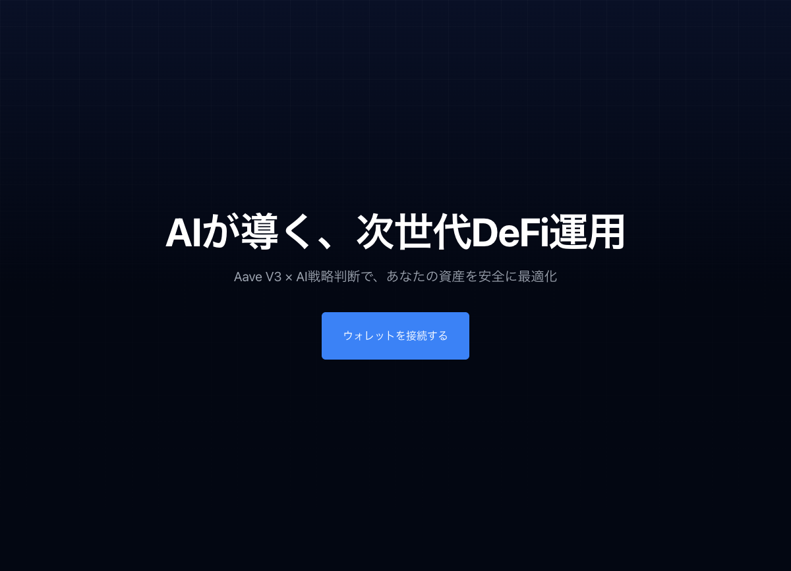
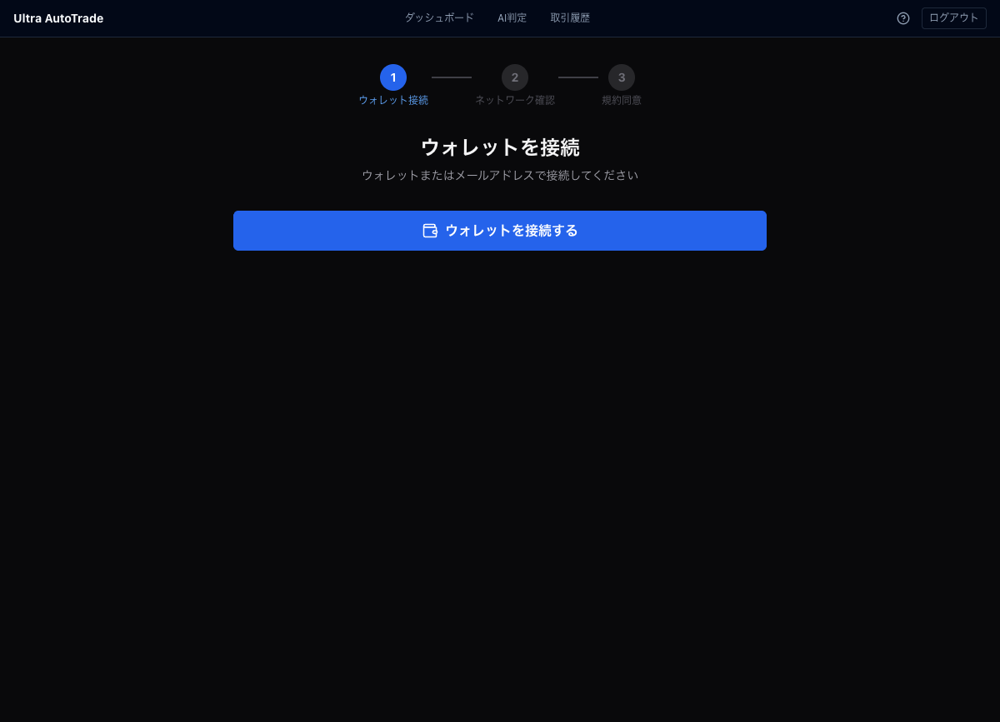

# テスター向けオンボーディングガイド v3

**対象:** Ultra AutoTrade テスター（読み取り専用ビューアー）
**対象環境:** staging（Base Sepolia テストネット）
**最終更新:** 2026-05-02
**E2E 検証済み:** tester-onboarding-flow.spec.ts（全テスト通過確認済み）

> **重要:** 本ガイドは staging 環境（テストネット）を対象としています。
> production（Base Mainnet・実資金）との差分は §7 を参照してください。

---

## §1 はじめに

### テスターの役割

Ultra AutoTrade では、パートナー（山本さん）が配分した資金を AI が自動運用します。テスターはその運用状況を **閲覧・監視する** 役割を担います。

**テスターは「閲覧専用（viewer）」権限** です。資金操作・取引承認はパートナー側で行うため、テスター側の操作は不要です。

| 機能 | viewer | 備考 |
|------|--------|------|
| ダッシュボード閲覧 | ✅ | |
| AI 判定履歴閲覧 | ✅ | |
| 取引履歴閲覧 | ✅ | |
| 緊急停止ボタン | ❌ | admin/partner のみ |
| 取引提案の承認 | ❌ | admin/partner のみ |
| ウォレット残高操作 | ❌ | パートナーが実施 |
| 設定変更 | ❌（閲覧のみ） | リスク設定等 |

### staging の現状（2026-05-02 時点）

- ネットワーク: **Base Sepolia テストネット**（実資産なし）
- AI 判定は 4 時間ごとに実行中
- 直近は **HOLD 判定のみ**（BUY/SELL 未発生が続く場合あり）
- Aave への実際の入出金はテストネットのみ

---

## §2 アクセスとログイン

### URL

**https://app-staging.ultra-auto-trade.com**

（テスト環境。production は §7 参照）

### ステップ 1: ランディングページを開く

URL にアクセスすると「AIが導く、次世代DeFi運用」が表示されます。
「**ウォレットを接続する**」ボタンをクリックして /connect に進みます。

### ステップ 2: Privy でログイン

**Privy** は Ultra AutoTrade が採用する認証基盤です。MetaMask のインストールは不要です。

1. **「ウォレットを接続する」** ボタンをクリック
2. Privy のモーダルが開く
3. **メールアドレス** でログインする場合:
   - メールアドレスを入力し、ワンタイムコードを受け取る
   - コードを入力して認証完了
4. **ソーシャルログイン**（Google / Apple）も選択可
5. 初回ログイン時に **embedded wallet（埋め込みウォレット）が自動生成** される

> **シードフレーズは不要です。** Privy の embedded wallet は SDK が内部管理するため、
> テスターが手動でシードフレーズを保管する必要はありません。

> `/register` でのメール登録は **管理者専用** です。テスターは必ず `/connect` からログインしてください。

### ステップ 3: ネットワーク確認

Privy 接続後、/connect ページがネットワークを自動確認します。

| 確認項目 | 期待値 |
|---------|-------|
| ネットワーク名 | Base Sepolia |
| チェーン ID | 84532 |
| 種別 | テストネット（実資産なし） |

「**Base Sepolia に切り替えてください**」と表示された場合は「Base Sepolia (テスト用) に切り替える」ボタンをクリックしてください。

### ステップ 4: 規約同意 → 運用開始

ネットワーク確認後、利用規約とリスク開示文書のチェックボックスが表示されます。
両方にチェックを入れ「**運用を開始する**」をクリックするとダッシュボードに移動します。

---

## §3 ダッシュボードの見方

ログイン後、ダッシュボード（`/user/dashboard`）で運用状況を確認できます。

### 主要指標（managed モード）

| 表示項目 | 意味 |
|---------|------|
| **割り振り額** | パートナーが配分した運用金額（ドル） |
| **ステータス** | active（稼働中）/ withdrawn（出金済み） |
| **PnL（損益）** | 割り振り額からの利益または損失額 |
| **最近の自動運用** | 直近の Aave 操作履歴（入出金など） |

### active / pro モードのみ表示される追加項目

- **Health Factor** — 担保借入比率の安全指標（1.6 以上で安全）
- **ポートフォリオ残高グラフ**
- **最新 AI 判定**（HOLD / BUY / SELL）

### 「資金がまだ割り振られていません」と表示される場合

パートナーからの資金配分待ちです。運営側に確認してください。

---

## §4 各ページの説明

| ページ | URL | 確認できる内容 |
|--------|-----|--------------|
| ダッシュボード | `/user/dashboard` | 割り振り額・PnL・最近の運用履歴 |
| AI 判定フィード | `/user/decisions` | 判定履歴（BUY/SELL/HOLD）・確信度・理由 |
| AI 判定フィード（旧） | `/user/ai-feed` | 同上（上と同等） |
| 承認待ち提案 | `/user/approve` | admin ユーザー向け提案一覧（viewer は閲覧のみ） |
| 設定 | `/user/settings` | 管理者向け設定（viewer はアクセス制限） |

### AI 判定フィード（/user/decisions）

- 4 時間ごとに更新
- 各判定: 「判定（BUY/SELL/HOLD）」「確信度（%）」「理由」「テクニカル/マクロ/センチメント要因」
- **HOLD が続く = 慎重に様子見中** であり、正常動作です

---

## §5 ガス代について（staging）

staging（Base Sepolia）では **テスト用 ETH** がガス代に必要です。

テスト資産（USDC）は運営が配布します。自分でフォーセットを使う必要はありません。

フォーセットを自分で使う場合（任意）:
- Alchemy Base Sepolia Faucet などのサービスを利用
- Privy の embedded wallet アドレスに送金

---

## §6 不具合を見つけたら

**Slack `#ultra-auto-project`** に投稿してください。

### 報告時に含める情報

| 項目 | 例 |
|------|-----|
| 発生日時 | 2026-05-02 14:35 JST |
| ブラウザと OS | Chrome 134 / macOS 15.4 |
| 発生したページ | https://app-staging.ultra-auto-trade.com/user/decisions |
| 何をしたら起きたか | 「AI判定フィード」を開いたら白い画面になった |
| スクリーンショット | 添付 |
| エラーメッセージ | 画面に表示された文字をそのままコピー |

### よくあるトラブル

| 症状 | 原因 | 対処 |
|------|------|------|
| ログイン後に白い画面 | Privy SDK 通信エラー | ページをリロード |
| 「Base Sepolia に切り替えて」と表示 | ネットワーク不一致 | /connect の「切り替える」ボタンをクリック |
| ダッシュボードに数値が表示されない | バックエンド接続中 / 資金未割り振り | 30秒待ってリロード、または運営に確認 |
| AI判定が更新されない（4時間以上） | スケジューラー停止の可能性 | Slack で報告 |
| 「まだ資金が割り振られていません」 | パートナーからの配分待ち | 運営に確認 |

---

## §7 production（Base Mainnet）利用時の差分

山本さん（パートナー）が使用する production 環境との差分です。

| 項目 | staging（本ガイド対象） | production |
|------|----------------------|------------|
| URL | https://app-staging.ultra-auto-trade.com | https://app.ultra-auto-trade.com |
| ネットワーク | Base Sepolia (chain 84532) | Base Mainnet (chain 8453) |
| 資産 | テスト用（価値なし） | 実資産（USDC） |
| AI 判定 | Shadow Mode（実取引なし） | 実取引あり |
| ガス代 | テスト ETH（フォーセット） | 実 ETH（取引所から入金） |
| Aave 運用 | Base Sepolia testnet | Base Mainnet |

### production でのガス代準備（山本さん向け）

1. 取引所（Bybit 等）で ETH を購入
2. MetaMask または Privy の embedded wallet に送金
3. ネットワーク: **Base Mainnet（chain ID: 8453）** を指定
4. 送金後、/connect でネットワーク確認 → 「Base Mainnet に接続済み」が表示されれば OK

---

## §8 FAQ

**Q: MetaMask は必要ですか？**
A: 不要です。Privy の embedded wallet を使うため、MetaMask のインストールは不要です。

**Q: シードフレーズを保管する必要はありますか？**
A: staging では不要です。Privy が内部管理します。production の実資産環境では、重要なウォレット（MetaMask 等）のシードフレーズは安全に保管してください。

**Q: ボタンがなくて操作できません。**
A: viewer 権限は閲覧専用です。緊急停止・承認・設定変更ボタンは admin/partner のみ表示されます（正常な仕様です）。

**Q: AI が「HOLD」ばかりです。正常ですか？**
A: 正常です。Phase 1 は保守的な運用方針のため HOLD が続くことがあります。

**Q: 「まだ資金が割り振られていません」と表示されます。**
A: パートナーからの資金配分待ち状態です。運営チームにお知らせください。

**Q: ログインできません（Privy エラー）。**
A: ブラウザのキャッシュをクリアしてリロードしてください。それでも解決しない場合は Slack `#ultra-auto-project` でご報告ください。

---

*最終更新: 2026-05-02 | ガイドバージョン: v3.0*
*E2E 検証: tester-onboarding-flow.spec.ts（staging-new にて全テスト通過確認済み）*
